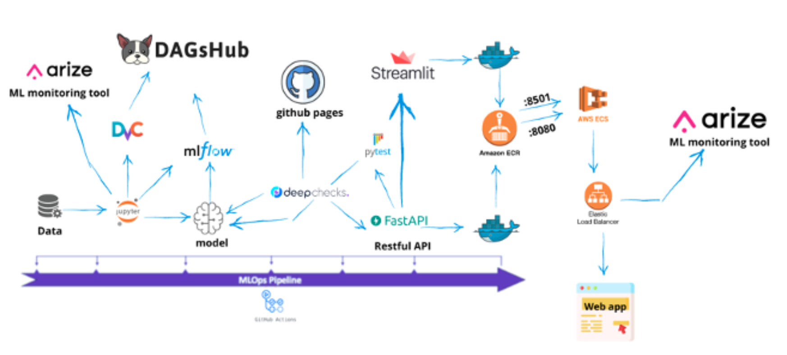

# MLOps Training

**Objectif**:
À mesure que l'importance de l'apprentissage automatique (Machine Learning) grandit avec le temps, il devient de plus en plus difficile pour les entreprises de créer un modèle de Machine Learning fiable et de le déployer en production. C'est là qu'intervient le rôle de MLOps. Il s'agit d'un ensemble d'outils et de pratiques visant à accélérer l'expérimentation, le déploiement et à garantir la qualité de nos systèmes de Machine Learning. 

